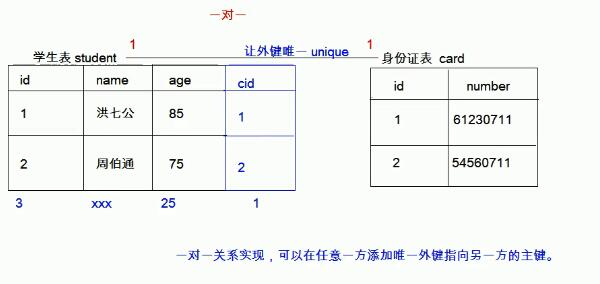
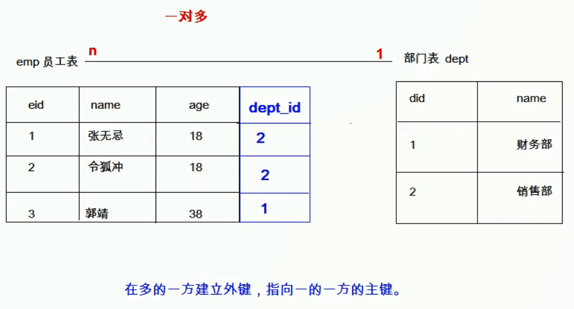
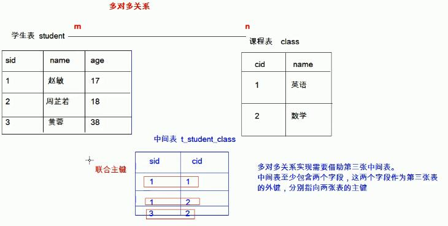
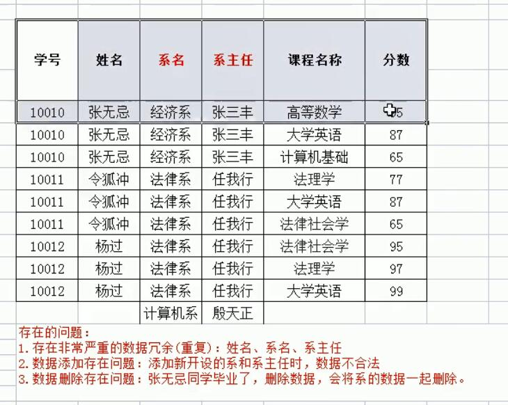
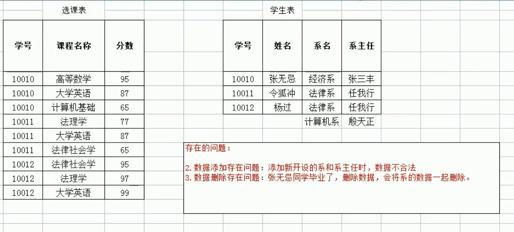
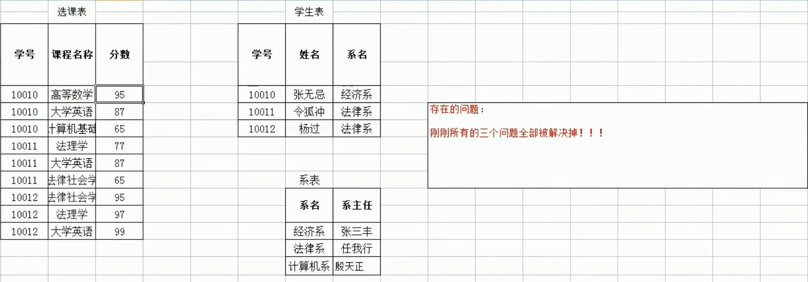

# SQL
## 什么是SQL
结构化查询语言(Structured Query Language)简称SQL。是一种特殊目的的编程语言，是一种数据库查询和程序设计语言，用于存取数据以及查询、更新和管理关系数据库系统；同时也是数据库脚本文件的扩展名。其实就是定义了操作所有关系型数据库的规则。每一种数据库操作的方式存在不一样的地方。

## SQL通用语法
1.SQL语句可以单行或多行书写，以分号结尾

2.MySQL数据库不区分大小写，但是建议关键字使用大写

3.三种注释
```
单行注释：-- 注释内容（--后需要加一个空格） 或 #注释内容（MySQL特有）
多行注释：/* 注释内容 */ 
```

## SQL分类
1.DDL：数据定义语言，用来定义数据库对象（数据库，表，列等），关键字：create，drop，alter等

2.DML：数据操作语言，用来对数据库中表的数据进行增删改，关键字：insert，delete，update等

3.DQL：数据查询语言，用来查询数据库中表的记录（数据），关键字：select，where等

4.DCL：数据控制语言，用来定义数据库的访问权限和安全级别，及创建用户，关键字：GRANT,REVOKE等

## DDL：操作数据库，表
### 操作数据库：CRUD  
1.C(Create)：创建
  - 创建数据库:  
    - create database 数据库名称;  
  - 创建数据库，判断是否存在，并指定字符集  
    - create database if not exists 数据库名称 character set 指定的字符集;  
    - 如：create database if not exists db2 character set gbk;  

2.R(Retrieve)：查询  
  - 查询所有数据库的名称  
    - show databases;  
  - 查询某个数据库的字符集：查询某个数据库的创建语句  
    - show create database 数据库名称;  

3.U(Update)：修改  
  - 修改数据库的字符集  
    - alter database 数据库名称 character set 字符集名称;  
    - 如：alter database db2 character set utf8;  

4.D(Delete)：删除   
  - 删除数据库  
    - drop database if exists 数据库名称;  

5.使用数据库  
  - 查询当前正在使用的数据库名称  
    - select database();  
  - 使用数据库  
    - use 数据库名称;  


### 操作表
1.C(Create)：创建  
  - 语法：create table 表名(列名1 数据类型,列名2 数据类型,列名3 数据类型),  最后一行的列不用加逗号  
  - 数据类型
    - int 整数类型 age int
    - double 小数类型 score double(5,2) 表示总的有5位，小数有两位，如999.99
    - date 日期类型 只包含年月日 yyyy-MM-dd
    - datetime 日期类型 包含年月日时分秒 yyyy-MM-dd HH:mm:ss
    - timestamp 时间戳类型 包含年月日时分秒 yyyy-MM-dd HH:mm:ss，如果将来不给这个字段赋值或赋值为null，则默认使用当前的系统时间来自动赋值
    - varchar 字符串类型 name varchar（20）表示最大20个字符
```ruby
-- 创建一张学生表
create table student(
  id int,
  name varchar(32),
  age int,
  score double(4,1),
  birthday date,
  insert_time timestamp
  );
```
  - 复制一张表：create table 新表名 like 想要复制的表;
    - 如：create table stu like student;

2.R(Retrieve)：查询  
  - 查询某个数据库中所有的名称
    - show tables;
  - 查询表结构
    - desc 表名;
  - 查询表的字符集
    - show create table 表名;

3.U(Update)：修改  
  - 修改表名
    - alter table 表名 rename to 新的表名;
  - 修改表的字符集
    - alter table 表名 character set 字符集名称;
  - 添加一列
    - alter table 表名 add 列名 数据类型;
  - 修改列的名称和类型
    - alter table 表名 change 列名 新列名 新数据类型; --可以修改列的名称和类型
    - alter table 表名 modify 列名 新数据类型; --只能修改类的数据类型
  - 删除列
    - alter table 表名 drop 列名; 

4.D(Delete)：删除   
  - drop table 表名;
  - drop table if exists 表名;

## DML增删改表中的数据
1.添加数据  
  - 语法
    - insert into 表名(列名1,列名2,...列名n) values(数据1,数据2,...数据n);
  - 注意
    - 列名和值一一对应（名字和类型）
    - 如果表名后不定义列名，则默认为给所有列添加值
    - 除了数字类型，其他类型需要用引号(""/'')引起来

2.删除数据  
  - 语法
    - delect from 表名 where 条件;
  - 注意
    - 如果不加条件，则删除表中所有记录
    - 如果要删除所有记录，可以使用 delete from 表名; -- 不推荐使用，这个操作是有多少条记录就会执行多少次删除操作，效率不高；可以使用TRUNCATE TABLE 表名; -- 这个操作是先删除表，然后再创建一个一模一样的空表

3.修改数据  
  - 语法
    - update 表名 set 列名1=值1, 列名2=值2, ... 列名n=值n where 条件;
  - 注意
    - 如果不加任何条件，则会将表中所有记录全部修改

## DQL：查询表中的记录
select * from 表名;

1.语法
```ruby
select 
  字段列表
from 
  表名列表 
where 
  条件列表
group by 
  分组字段
having 
  分组之后的条件限定
order by 
  排序
limit 
  分页限定
```
2.基础查询
```ruby
-- 用下面的SQL语句创建的表为例
CREATE TABLE stu(
  id int, -- 编号
  name VARCHAR(20), -- 姓名
  age int, -- 年龄
  sex VARCHAR(5), -- 性别
  address VARCHAR(100), -- 地址
  math int, -- 数学
  english int -- 英语
);

INSERT INTO stu 
(id,name,age,sex,address,math,english) VALUES 
(1,"托儿索",5,'男',"符文大陆",20,80),
(2,"小学僧",6,'男',"符文大陆",30,30),
(3,"儿童劫",6,'男',"符文大陆",50,null),
(4,"望远烬",8,'男',"未知",60,45);
```
(1).多个字段的查询  
```ruby
-- 标准写法
-- 查询表中的姓名和年龄
SELECT 
  name, -- 姓名
  age -- 年龄
from 
  stu;
```
(2).去除重复
```ruby
-- 只有查询出来的结果集完全一样，才能去除
-- 查询不同的地址，用distinct
SELECT DISTINCT address from stu;
```
(3).计算列
```ruby
-- 计算数学和英语之和
SELECT name,math,english , math + english from stu; -- 如果在运算过程中有null参与运算，计算结果会都为null
SELECT name,math,english , math + IFNULL(english,0) from stu;  -- 用ifnull修改，如果为null，改为0
```
(4).起别名
```ruby
-- 将上面求出的数学和英语之和的列表名叫做总分
-- 用as
SELECT name,math,english , math + IFNULL(english,0) as 总分 from stu;
-- 不用as，用一个或多个空格也可以实现
SELECT name,math,english , math + IFNULL(english,0)   总分 from stu;
```
3.条件查询  
(1).where字句后跟条件  
(2).运算符
```
!= 、 < 、 > 、 <= 、 >= 、 = 、 <>
between ... and
in(集合) --在这个集合中出现的
like  -- 模糊查询
  占位符：_:表示单个字符；%_:表示零个或多个字符
is null
and 或 &&
or 或 ||
not 或 !
```
4.排序查询
  - 语法：order by 子句
    - order by 排序字段1 排序方式1 ， 排序字段2 排序字段2 ....
    - 如果有多个排序条件，则当前边的条件值一样时，才会判断后面的条件
  - 排序方式
    - ASC：升序，默认的
    - DESC：降序
```ruby
-- 先按数学降序排序，然后在按英语降序排序
select * from stu ORDER BY math DESC , english DESC;
```
5.聚合函数：将一列数据作为一个整体，进行纵向的计算
```ruby
-- 1.count：计算个数
SELECT COUNT(id) from stu;  -- 4
SELECT COUNT(english) from stu;  -- 3 聚合函数的计算，会排除null值
-- 解决排除null值后，个数不准确的方法，一般选择主键，或直接用*（只要一行中有一个数据不为空，就算一列）
SELECT COUNT(ifnull(english,0)) from stu;
SELECT COUNT(*) from stu;

-- 2.max/min：计算最大/最小
SELECT max(english) from stu;
SELECT min(IFNULL(english,0)) from stu;

-- 3.sum：计算和
SELECT sum(english) from stu;

-- 4.avg：计算平均値
SELECT avg(IFNULL(english,0)) from stu;

-- 注意：聚合函数的计算，会排除null值
-- 解决方案：用ifnull解决，或选择不包含非空的列进行计算，主键
```

6.分组查询：统计一个具有相同特征的某一类数据，把这些数据当做一个整体来看一些整体的信息
  - 语法：group by 分组字段;
  - 注意
    - 分组之后查询的字段只能为分组字段或聚合函数，其他字段没有意义
    - where和having的区别：1.where在分组之前进行限定，如果不满足条件，则不参与分组；having在分组之后进行限定，如果不满足结果，则不会被查询出来；2.where后不可以跟聚合函数，having可以进行聚合函数的判断
```ruby
-- 按年龄分组，分别查询每个年龄的人的数学平均分和人数
SELECT age,AVG(math),COUNT(id)  人数 from stu GROUP BY age;
-- 按年龄分组，分别查询每个年龄的人的数学平均分和人数，分数低于20分的人，不参与分组
SELECT age,AVG(math),COUNT(id)  人数 from stu where math > 20 GROUP BY age;
-- 按年龄分组，分别查询每个年龄的人的数学平均分和人数，分数低于20分的人，不参与分组，并且分组的人数>=2
SELECT age,AVG(math),COUNT(id)  人数 from stu where math > 20 GROUP BY age having count(id) >=2;
SELECT age,AVG(math),COUNT(id)  人数 from stu where math > 20 GROUP BY age having 人数 >=2;
```
7.分页查询
  - 语法：limit 开始的索引,每页查询的条数;
  - 公式：开始的索引=（当前的页码-1）*每页显示的条数
  - 在MySQL中分页操作的语法limit是一个"方言",只能在MySQL中使用，别的数据库的分页操作有自己独特的语法
```
-- 每页显示2条记录
SELECT * from stu LIMIT 0,2; -- 第1页
SELECT * from stu LIMIT 2,2; -- 第2页，第一个2表示从第二条数据开始，这个值可以用公式计算出来
```
## 约束
概念：对表中的数据进行限定，保证数据的正确性、有效性和完整性。  
分类  
1.主键约束：primary key  
  - 注意
    - 含义：非空且唯一
    - 一张表只能有一个字段为主键
    - 主键就是表中记录的唯一标识
  - 在创建表时，添加主键约束
  ```
  create table stu(
    id int primary key, -- 给id添加主键约束
    name varchar(20);
  );
  ```
  - 创建表后，添加主键约束
  ```
  alter table stu modify id int primary key;
  ```
  - 删除主键约束
  ```
  -- 不能直接修改列的属性
  alter table stu drop primary key;
  ```
  - 自动增长：一般跟主键一起使用
    - 概念：如果某一列是数值类型的，使用auto-increment可以来完成值的自动增长
    - 在创建表时，添加主键约束并完成自动增长
    ```
    create table stu(
      id int primary key auto-increment, -- 给id添加主键约束,并实现自动增长
      name varchar(20);
    );
    -- 假如表中有(1,a),现在添加数据(null,b),在表中成为(1,a)(2,b),再添加(5,c),表中数据(1,a)(2,b)(5,c),此时再添加数据(null,d)，数据变成(1,a)(2,b)(5,c)(6,d),说明自动增长的值只与前一个数据有关
    ```
    - 表创建好后，添加自动增长
    ```
    alter table stu modify id int primary key auto-increment;
    ```
    - 删除自动增长
    ```
    alter table stu modify id int; -- 这样删不掉主键，可以删掉自动增长
    ```

2.非空约束：not null,某一列的值不能为null  
  - 创建表时添加非空约束
  ```
  create table stu (
    id int,
    name varchar(20) not null -- name为非空
  );
  ```
  - 删除非空约束
  ```
  -- 修改列的属性
  ALTER TABLE stu MODIFY name VARCHAR(20);
  ```
  - 创建表结束后，添加非空约束
  ```
  ALTER TABLE stu MODIFY name VARCHAR(20) not full;
  ```

3.唯一约束：unique，某一列的值不能重复  
  - 在创建表时，添加唯一约束
  ```
  create table stu (
    id int,
    phone_number VARCHAR(20) UNIQUE  -- 手机号为空
  );
  ```
  - 在创建表后，添加唯一约束
  ```
  ALTER TABLE stu MODIFY phone_number VARCHAR(20) UNIQUE;
  ```
  - 删除唯一约束
  ```
  -- 不可以像非空约束一样，直接修改列的属性
  alter table stu drop index phone_number;
  ```
  - 注意
    - 唯一约束可以有null值，但是只能有一条记录为null

4.外键约束：foreign key，让表与表产生关系，从而保证数据的正确性  
  - 在创建表时，添加外键约束，在添加外键值的时候可以为null，但是不能为不存在的值，只能是主表存在的值
  ```
  -- 语法
  create table 表名(
    ... -- 一些列
    外键列 
    constraint 外键名称 foreign key (外键列的名称) references 主表名称(主表列，唯一约束的列名称)
  );
  ```
   - 创建完成后，再添加外键约束
   ```
   alter table 子表名 add constraint 外键名称 foreign key (外键列的名称) references 主表名称(主表列，唯一约束的列名称);
   ```
   - 删除外键约束
   ```
   alter table 子表名 drop foreign key 外键列的名称;
   ```
   - 级联操作
     - 添加级联操作：alter table 表名 add constraint 外键名称 foreign key (外键字段名称) references 主表名称(主表列名称) on update cascade(级联更新) on delete cascade(级联删除);
     - 分类：1.级联更新：on update cascade；2.级联删除：on delete cascade
   
## 数据库设计
1.多表之间的关系  
  - 分类
    - 一对一关系（了解，以后应用很少存在）
    - 一对多（多对一）的关系
    - 多对多的关系
  - 实现关系
    - 1.一对一的关系：一对一的实现，可以在任意一方添加唯一外键指向另一方的主键。如果出现一对一的关系，可以将他们合成一张表。  

    - 2.一对多（多对一）的关系：一对多的实现，在多的一方建立外键，指向一的一方的主键

    - 3.多对多的关系:多对多关系实现需要借助第三张中间表，中间表至少包含两个字段，这两个字段作为第三张表的外键，分别指向两张表的主键

    
2.数据库设计的范式  
  * 设计数据库时，需要遵循的一些规范。要遵循后边范式的要求，必须先遵循前边的所有范式要求。
  * 设计关系数据库时，遵从不同的规范要求，设计出合理的关系型数据库，这些不同的规范要求被称为不同的范式，各种范式呈递次规范，越高的范式数据库冗余越小。目前关系数据库有六种范式：第一范式（1NF）、第二范式（2NF）、第三范式（3NF）、巴斯-科德范式（BCNF）、第四范式(4NF）和第五范式（5NF，又称完美范式）。
  * 分类
    * 第一范式(1NF)：数据库表的每一列都是不可分割的原子数据项。在任何一个关系数据库中，第一范式（1NF）是对关系模式的基本要求，不满足第一范式（1NF）的数据库就不是关系数据库。   
 
    * 第二范式(2NF)：在1NF的基础上，非码属性必须完全依赖于候选码（在1NF基础上消除非主属性对主码的部分函数依赖）
      * 1.函数依赖：A-->B，如果通过A属性（属性组）的值，可以确定唯一B属性的值，则称B依赖于A。例如：学号-->姓名，(学号，课程名称)-->分数
      * 2.完全函数依赖：A-->B，如果A是一个属性组，则B属性值的确定需要依赖于A属性组中的所有属性值。例如：(学号，课程名称)-->分数
      * 3.部分函数依赖：A-->B，如果A是一个属性组，则B属性值的确定只需要依赖于A属性组中的某一些属性值即可。例如：（学号，课程名称）-->姓名
      * 4.传递函数依赖：A-->B,B-->C，如果通过A属性（属性组）的值，可以确定唯一B属性的值，再通过B属性（属性组）的值可以确定唯一C属性的值，则称C传递函数依赖于A。例如：学号-->系名，系名-->系主任，则，学号-->系主任
      * 5.码：如果在一张表中，一个属性或属性组，被其他所有属性所完全依赖，则称这个属性（属性值）为该表的码
        * 主属性：码属性组中的所有属性
        * 非主属性：除过码属性组的属性  

    * 第三范式(3NF)：在2NF基础上，任何非主属性不依赖于其它非主属性（在2NF基础上消除传递依赖） 


## 数据库的备份和还原
1.命令行
  * 语法：mysqldump -u用户名 -p密码 数据库的名称 > 保存的路径
  * 还原：
    * 登录数据库
    * 创建数据库
    * 使用数据库
    * 执行文件。命令：source 文件路径
2.图形化工具


