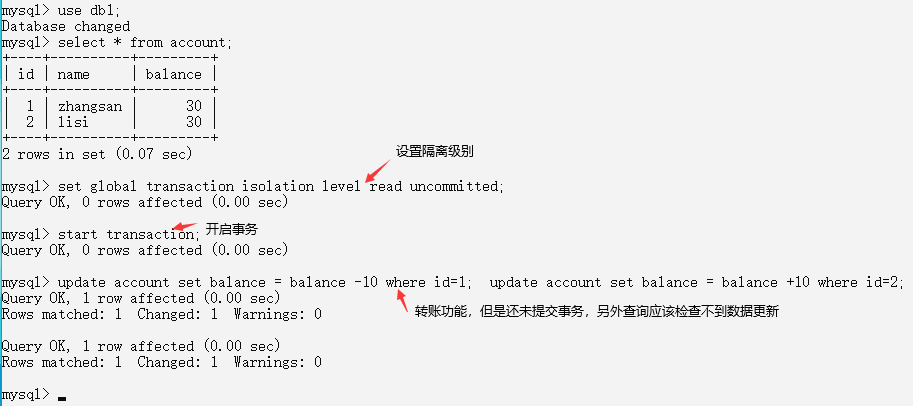

# 事务
1.事务的基本介绍  
  * 概念：如果一个包含多个步骤的业务操作，被事务管理，那么这些操作要么同时成功，要么同时失败。
  * 操作
    * 1.开启事务：start transaction
    * 2.回滚：rollback
    * 3.提交：commit
    * 4.数据库中事务提交的两种方式
      * 自动提交 
        * 在MySQL数据库中事务默认自动提交
        * 一条DML(增删改)语句会自动提交一次事务，数据会被持久化更新
      * 手动提交
        * Oracle 数据库默认是手动提交事务
        * 需要先开启事务，再提交，如果没有提交，数据不会被持久化更新，在没提交前推出，系统默认回滚，不会保存修改
      * 修改事务的默认提交方式
        * 1.查看事务的默认提交方式：SELECT @@autocommit;  -- 1 代表自动提交，0 代表手动提交
        * 2.修改默认提交方式：SET @@autocommit=0;
```
-- 创建一个新的表
create table account (
  id int primary key auto_increment,
  name varchar(10),
  balance double
);

-- 添加数据
insert into account(name,balance) values ('zhangsan',1000),('lisi',1000);
```
```
事务的案例：张三给李四转账500
分析：
1.判断张三的余额是否大于500
2.如果大于，张三账户-500
3.李四账户+500
事务的概念是其中有一步执行不成功，整个事务就执行失败，不然会造成错误
未开启事务的代码：
-- 张三账户 -500
update account set balance = balance-500 where name = 'zhangsan';
-- 李四账户 +500
-- 若在这一步添加一条错误代码，则上一步执行，下一步未执行，则会出现错误
update account set balance = balance+500 where name = 'lisi';

-- 开启事务
START TRANSACTION;
-- 张三账户 -500
update account set balance = balance-500 where name = 'zhangsan';
-- chucuola.... 
-- 李四账户 +500
update account set balance = balance+500 where name = 'lisi';
-- 发现出错要进行回滚，回滚到这个事务开始所在的位置
ROLLBACK;
-- 执行结束，没有异常，则提交事务
COMMIT;

```
2.事务的四大特征  
  * 原子性：事务是不可分割的最小操作单位，要么同时成功，要么同时失败
  * 持久性：如果事务一旦提交或者回滚后，数据库会持久化的保存数据
  * 隔离性：多个事务之间相互独立，不产生相互影响
  * 一致性：事务操作前后，数据总量不变

3.事务的隔离级别  
  * 概念：多个事务之间隔离，相互独立，但是如果多个事务操作同一批数据，则会引发一些问题，设置不同的隔离级别就可以解决这些问题
  * 存在问题
    * 1.脏读：一个事务读取到另一个事务中没有提交的数据，这相当危险，可能导致所有的操作都被回滚
    * 2.不可重复读：在同一个事务中，两次读取到的数据不同
      * 幻读：事务在操作过程中进行两次查询，第二次查询的结果包含了第一次查询中未出现的数据或者缺少了第一次查询中出现的数据（这里并不要求两次查询的SQL语句相同）。这是因为两次查询过程中有一个事务插入数据造成的
      * 虚读：事务T1读取某一数据后，事务T2对其做了修改，当事务T1再次读取该数据时得到了与前一次不同的结果
    * 3.更新丢失：两个事务同时更新一行数据，一个事务对数据的更新把另一个事务对数据的更新覆盖了。这是由于系统没有执行任何的锁操作，因此并发事务没有被隔离开来
  * 隔离级别
    * 1.read uncommitted：读未提交
      * 产生的问题：脏读，不可重复读，幻读
    * read committed：读已提交（Oracle默认）
      * 产生的问题：不可重复读，幻读 
    * repeatable read：可以重复读（MySQL默认）
      * 产生的问题：幻读 
    * serializable：串行化
      * 可以解决所有问题 
    * 注意：隔离级别从小到大安全性越来越高，但是效率越来越低
    * 数据库查询隔离级别：select @@tx_isolation;
    * 数据库设置隔离级别：set global transaction isolation level 级别字符串; 如：set global transaction isolation level serializable; 设置数据库隔离级别的设置，要重新连接才能生效

4.演示不同的事务隔离级别
  * read uncommitted：读未提交
  ```ruby
  -- 设置隔离级别
  set global transaction isolation level read uncommitted;
  -- 开启事务
  start transaction;
  -- 开始转账操作
  update account set balance = balance -10 where id=1;
  update account set balance = balance +10 where id=2;
  
  这里的操作是同时开两个数据库，同时开启事务，其中一个开始转账，但是还未提交事务，本来数据还未持久化修改，另一个应该还读不到，但是在这种隔离级别下，另一个能读取到还未提交的数据，这就是脏读。如下面的截图。
  如果这样操作：张三先执行提交事务，转账，然后然李四查询，结果李四查到钱已经到账户，然后张三再进行回滚操作，然后进行回滚操作，这个时候事务结束，结果钱没转给李四。李四两次查询查到的结果不同，说明还产生了不可重复读的问题。
  ```
  
  
  * read committed：读已提交
  ```ruby
  解决脏读的问题，可以把隔离级别设置成读已提交
  -- 设置隔离级别
  set global transaction isolation level read committed;
  -- 开启事务
  start transaction;
  -- 开始转账操作
  update account set balance = balance -10 where id=1;
  update account set balance = balance +10 where id=2;
  -- 提交事务
  commit;
  -- 这次要等张三提交了事务后，李四才能查询到钱到了，解决了脏读的问题，但是李四两次查询的结果还是不一样，还是发生了不可重复读的问题
  ```
  * repeatable read：可以重复读
  ```ruby
  解决不可重复读的问题，把隔离级别设置成可以重复读
  -- 设置隔离级别
  set global transaction isolation level repeatable read;
  -- 开启事务
  start transaction;
  -- 开始转账操作
  update account set balance = balance -10 where id=1;
  update account set balance = balance +10 where id=2;
  -- 提交事务
  commit;
  -- 这里提交，另一边也不能查询到修改后的数据，解决了数据不可重复读的问提，只有当另外一边的事务也提交后，才能查询到修改后的数据
  ```
  * serializable：串行化
  ```ruby
  串行化：其实是一个锁表的操作，如果一个事务再操作一个数据表，另一个事务是不可以在操作这张表的，只有当上一个事务提交后，锁打开，它才能对这个表进行操作
  -- 设置隔离级别
  set global transaction isolation level serializable;
  -- 开启事务
  start transaction;
  -- 开始转账操作
  update account set balance = balance -10 where id=1;
  update account set balance = balance +10 where id=2;
  -- 提交事务
  commit;
  -- 只有当一个事务提交后，另一个事务才能操作这张表，如果上一个事务没有提交，这个事务就写好命令，但是进不去这张表，光标会一直在闪，当上个事务一提交，则这个事务会马上进入这个表
  ```


