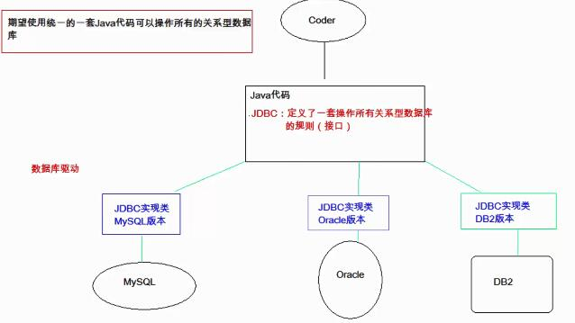

# JDBC
## 概念
java database connectivity，java数据库连接，java语言操作数据库  
JDBC的本质：其实是官方（Sun公司）定义的一套操作所有关系型数据库的规则，即接口。各个数据库厂商去实现这套接口，提供数据库驱动（JDBC的实现类，各个数据库版本的实现类不同）jar包。我们可以使用这套接口（JDBC）编程，真正执行的代码是驱动jar包中的实现类。  
  

## 快速入门
  * 步骤
    * 导入驱动jar包
      *  复制 mysql-connector-java-5.1.37到项目的libs文件夹目录下
      *  文件夹右键-->Add As Library ，这一步操作才是真正将jar包，加入到项目中
    * 注册驱动，让程序知道用的是哪一个版本或哪一个驱动包
    * 获取数据库的连接对象：connection
    * 定义sql语句
    * 获取执行sql语句的对象 statement
    * 执行sql，接受返回的结果
    * 处理结果
    * 释放资源
```ruby
代码实现：
public static void main(String[] args) throws Exception {
        //1.导入驱动jar包
        //2.注册驱动
        Class.forName("com.mysql.jdbc.Driver"); //把这个类文件加载进内存，加载进内存后会自动执行
        //3.获取数据库连接对象
        Connection conn = DriverManager.getConnection
                ("jdbc:mysql://localhost:3306/db1", "", "");
        //4.定义sql语句
        String sql = "update account set balance=500 where id=1";
        //5.获取执行sql的对象statement
        Statement stmt = conn.createStatement();
        //6.执行sql
        int count = stmt.executeUpdate(sql);
        //7.处理结果
        System.out.println(count);
        //8.释放资源
        stmt.close();
        conn.close();
    }
//执行结束后，数据库中的数据被成功修改
```
## 详解各个对象
1.DriverManager：驱动管理对象
  * 功能
    * 注册驱动：告诉程序该使用哪一个数据库驱动jar
      * 方法：static void registerDriver(Driver driver) 向 DriverManager 注册给定驱动程序。  、
      * 写代码使用：Class.forName("com.mysql.jdbc.Driver");
      * 通过查看源码发现：在com.mysql.jdbc.Driver类中存在静态代码块，会自动运行
      ```Ruby
      //源码
      static {
        try {
            java.sql.DriverManager.registerDriver(new Driver());  //注册驱动
        } catch (SQLException E) {
            throw new RuntimeException("Can't register driver!");
        }
      }
      ```
      * 注意：mysql5版本以后，这里可以省略不写，因为在刚刚导入的jar包中，META-INF文件中java.sql.Driver文件中帮我们写了，如果我们没写驱动，它会首先帮我们执行这个文件，自动注册驱动
    * 获取数据库连接
      * 方法：static Connection getConnection(String url, String user, String password)
      * 参数：url 指定连接的路径（语法：jdbc:mysql://ip地址(域名):端口号/数据库名称）；user 用户名；password 密码
      * 注意：如果连接的是一个本机mysql服务器，并且mysql服务器默认端口3306，则url可以简写为：kdbc:mysql:///数据库名称

2.Connection：数据库连接对象
  * 功能
    * 获取执行sql的对象
      * Statement createStatement()
      * PreparedStatement prepareStatement(String sql) 
    * 管理事务：
      * 开启事务：void setAutoCommit(boolean autoCommit)，调用该方法设置参数为false，即开启事务
      * 提交事务：void commit()  
      * 回滚事务：void rollback() 

3.Statement：执行sql的对象
  * 功能
    * 执行sql
      * boolean execute(String sql)：可以执行任意的sql，只需了解
      * int executeUpdate(String sql)：执行DML（insert、update、delete等对数据操作）语句、DDL（create、alter、drop等对库和表操作）语句
        * int返回值：受到影响的行数，可以通过这个受到影响的行数判断DML语句是否执行成功，返回值>0的则执行成功，反之则失败
      * ResultSet executeQuery(String sql)：执行DQL（select）语句
```ruby
练习statement：
1.account表 添加一条数据
2.account表 修改数据
3.account表 删除一条数据

1.添加数据，用比较规范的格式，异常捕获，关闭资源
public static void main(String[] args) {
        Connection conn =null;
        Statement stmt = null;
        try{
            //1.注册驱动
            Class.forName("com.mysql.jdbc.Driver");
            //2.定义sql语句
            String sql = "insert into account value(null,'wangwu','2000')";
            //3.获取数据库连接对象
            conn = DriverManager.getConnection
                    ("jdbc:mysql://localhost:3306/db1", "", "");
            //4.获取执行sql的对象statement
            stmt = conn.createStatement();
            //5.执行sql
            int count = stmt.executeUpdate(sql); //count是影响的行数
            //6.处理结果
            if (count > 0)
                System.out.println("成功");
            else
                System.out.println("失败");
        }catch (ClassNotFoundException | SQLException e){
            e.printStackTrace();
        }
        finally{
            //因为前面定义为空，如果try代码块中出错，就会出现空指针异常，所以为了避免空指针异常，应先进行一次判断
            if (stmt != null)
                try{
                    stmt.close();
                }catch (SQLException e){
                    e.printStackTrace();
                }
            if (conn != null)
                try{
                    conn.close();
                }catch (SQLException e){
                    e.printStackTrace();
                }
        }
    }
    
2.修改数据
//只用修改上一个代码的sql语句部分，其余部分不变
String sql = "update account set balance = 1000 where id = 3";

3.删除一条数据
//只用修改上一个代码的sql语句部分，其余部分不变
String sql = "delete from account where id = 3";

表的创建也可以使用executeupdate，但是它影响行的数量为0
```
4.ResultSet：结果集的对象，封装查询结果
  * 方法
    * next()：光标（游标）向下移动一行，一行一行的向下移动，判断当前行是否是最后一行末尾（是否还有数据），如果是最后一行末尾（没有数据）则返回false，否则返回true
    * getxxx(参数)：获取数据
      * xxx：代表数据类型，如：int getInt();String getString()
      * 参数
        * int：代表列的编号,从1开始，如：getString(1)，获取第一列
        * String：代表列的名称，如：getDouble("balance")，获取balance这一列的数据
    * 注意
      * 使用步骤
        * 游标向下移动一行
        * 判断是否有数据
        * 获取数据
```ruby
public static void main(String[] args) {
        Connection conn =null;
        Statement stmt = null;
        ResultSet rs = null;
        try{
            //1.注册驱动
            Class.forName("com.mysql.jdbc.Driver");
            //2.定义sql语句
            String sql = "select * from account";
            //3.获取数据库连接对象
            conn = DriverManager.getConnection
                    ("jdbc:mysql://localhost:3306/db1", "", "");
            //4.获取执行sql的对象statement
            stmt = conn.createStatement();
            //5.执行sql
            rs = stmt.executeQuery(sql); //count是影响的行数
            //6.处理结果
            //6.1让游标向下移动一行，默认在第一行表头哪行
            while(rs.next()) {//循环判断游标是否为最后一行
                //6.2获取数据
                int id = rs.getInt("id");
                String name = rs.getString(2);
                double balance = rs.getDouble(3);
                System.out.println(id + "  " + name + "   " + balance);
            }
        }catch (ClassNotFoundException | SQLException e){
            e.printStackTrace();
        }
        finally{
            //因为前面定义为空，如果try代码块中出错，就会出现空指针异常，所以为了避免空指针异常，应先进行一次判断
            if (rs != null)
                try{
                    rs.close();
                }catch (SQLException e){
                    e.printStackTrace();
                }
            if (stmt != null)
                try{
                    stmt.close();
                }catch (SQLException e){
                    e.printStackTrace();
                }
            if (conn != null)
                try{
                    conn.close();
                }catch (SQLException e){
                    e.printStackTrace();
                }
        }
    }
```
```ruby
//练习：定义一个方法，查询emp表的数据将其封装成对象，然后装载成集合，返回。
package cn.jdbc;
import java.util.Date;
//封装Emp表数据的javaBean
public class Emp {
    private int id;
    private String ename;
    private int job_id;
    private int mgr;
    private Date joindate;
    private double salary;
    private double bonus;
    private int dept_id;
    public Emp() {
    }
    public int getId() {
        return id;
    }
    public void setId(int id) {
        this.id = id;
    }
    public String getEname() {
        return ename;
    }
    public void setEname(String ename) {
        this.ename = ename;
    }
    public int getJob_id() {
        return job_id;
    }
    public void setJob_id(int job_id) {
        this.job_id = job_id;
    }
    public int getMgr() {
        return mgr;
    }
    public void setMgr(int mgr) {
        this.mgr = mgr;
    }
    public Date getJoindate() {
        return joindate;
    }
    public void setJoindate(Date joindate) {
        this.joindate = joindate;
    }

    public double getSalary() {
        return salary;
    }

    public void setSalary(double salary) {
        this.salary = salary;
    }
    public double getBonus() {
        return bonus;
    }
    public void setBonus(double bounds) {
        this.bonus = bounds;
    }

    public int getDept_id() {
        return dept_id;
    }
    public void setDept_id(int dept_id) {
        this.dept_id = dept_id;
    }
    @Override
    public String toString() {
        return "Emp{" +
                "id=" + id +
                ", ename='" + ename + '\'' +
                ", job_id=" + job_id +
                ", mgr=" + mgr +
                ", joindate=" + joindate +
                ", salary=" + salary +
                ", bounds=" + bonus +
                ", dept_id=" + dept_id +
                '}';
    }
}

package cn.jdbc;
//定义一个方法，查询emp表的数据将其封装成对象，然后装载成集合，返回
import java.sql.*;
import java.util.ArrayList;
import java.util.Date;
import java.util.List;
public class JDBCDemo3 {
    //查询所有emp对象
    public List<Emp> findAll() {
        Connection conn =null;
        Statement stmt = null;
        ResultSet rs = null;
        List<Emp> list = new ArrayList<>();
        try{
            //1.注册驱动
            Class.forName("com.mysql.jdbc.Driver");
            //2.定义sql语句
            String sql = "select * from emp";
            //3.获取数据库连接对象
            conn = DriverManager.getConnection
                    ("jdbc:mysql://localhost:3306/db1", "", "");
            //4.获取执行sql的对象statement
            stmt = conn.createStatement();
            //5.执行sql
            rs = stmt.executeQuery(sql); //count是影响的行数
            //6.处理结果集，封装对象，装载集合
            Emp emp = null;
            while(rs.next()) {
                //获取数据
                int id = rs.getInt("id");
                String ename = rs.getString("ename");
                int job_id = rs.getInt("job_id");
                int mgr = rs.getInt("mgr");
                Date joindate = rs.getDate("joindate");
                double salary = rs.getDouble("salary");
                double bonus = rs.getDouble("bonus");
                int dept_id = rs.getInt("dept_id");
                //创建emp对象，复用,并赋值
                emp = new Emp();
                emp.setId(id);
                emp.setEname(ename);
                emp.setJob_id(job_id);
                emp.setMgr(mgr);
                emp.setJoindate(joindate);
                emp.setSalary(salary);
                emp.setBonus(bonus);
                emp.setDept_id(dept_id);

                //装载集合
                list.add(emp);
            }
        }catch (ClassNotFoundException | SQLException e){
            e.printStackTrace();
        }
        finally{
            //因为前面定义为空，如果try代码块中出错，就会出现空指针异常，所以为了避免空指针异常，应先进行一次判断
            if (rs != null)
                try{
                    rs.close();
                }catch (SQLException e){
                    e.printStackTrace();
                }
            if (stmt != null)
                try{
                    stmt.close();
                }catch (SQLException e){
                    e.printStackTrace();
                }
            if (conn != null)
                try{
                    conn.close();
                }catch (SQLException e){
                    e.printStackTrace();
                }
        }
        return list;
    }

    public static void main(String[] args){
        List<Emp> list = new JDBCDemo3().findAll();
        System.out.println(list);
    }
}
```
5.PreparedStatement：执行sql的对象，功能比statement强大
  * SQL注入问题：在拼接sql时有一些sql的特殊关键字参与字符串的拼接，会造成安全性问题
    * 用户名随便写一个，密码写：a' or 'a' = 'a，在sql语句中拼接出来为：select * from user where username = 'gfdsgdsf' and password = 'a' or 'a' = 'a',这条sql语句必定会被执行，并且查询出所有结果
  * 解决SQL注入问题：使用PreparedStatement对象来解决
  * 预编译的SQL：参数用?作为占位符
  * 使用步骤
    * 导入驱动jar包
    * 注册驱动，让程序知道用的是哪一个版本或哪一个驱动包
    * 获取数据库的连接对象：connection
    * 定义sql语句
      * 注意：sql的参数使用?作为占位符，如：select * from user where username = ? and password = ?;
    * 获取执行sql语句的对象 PreparedStatement，调用Connection.prepareStatement(String sql)方法
    * 给?赋值
      * setxxx(参数1,参数2)--参数1是?的位置，从1开始，参数2是?的值
    * 执行sql，接受返回的结果，不需要传递sql语句，因为在执行sql语句的时候已经传递过了
    * 处理结果
    * 释放资源
  * 注意：后期都是使用PreparedStatement来完成增删改查的所有操作，因为它可以防止SQL注入并且效率更高

## 抽取JDBC的工具类：JDBCUtils
目的：简化书写
分析
  * 抽取一个方法注册驱动
  * 抽取一个方法获取连接对象
    * 需求：不传递参数，还要保证工具类的通用性
    * 解决方案：用配置文件
  * 抽取一个方法释放资源
```ruby
import java.io.FileReader;
import java.io.IOException;
import java.net.URL;
import java.sql.*;
import java.util.Properties;
/*
* JDBC工具类
* */
public class JDBCUtils {
    //定义三个变量，然后读取配置文件，然后赋值
    private static String url;
    private static String user;
    private static String password;
    private static String driver;

    //文件的读取，只需读取一次即可拿到这些值，使用静态代码块，会随着类的加载执行，只执行一次
    static{
        //读取配置文件，获取值
        try {
            //创建properties集合类
            Properties pro = new Properties();
            //获取src路径下的文件的方式-->ClassLoder 类加载器
            //类加载器可以将文件加载进内存，并且获取路径
            ClassLoader classLoader = JDBCUtils.class.getClassLoader();
            //classLoader.getResource方法：传一个文件名，就能得到其资源
            URL res = classLoader.getResource("jdbc.properties");
            //将文件的绝对路径转成字符串
            String path = res.getPath();
            System.out.println(path);
            //加载文件
            //pro.load(new FileReader("src/cn/jdbc.properties"));
            pro.load(new FileReader(path));
            //获取数据，赋值
            url = pro.getProperty("url");
            user = pro.getProperty("user");
            password = pro.getProperty("password");
            driver = pro.getProperty("driver");
        } catch (IOException e) {
            e.printStackTrace();
        }
    }


    //获取连接，@return连接对象
    public static Connection getConnection() throws SQLException {

        return DriverManager.getConnection(url,user,password);
    }

    //释放资源
    public static void close(Statement stmt, Connection conn){
        if (stmt != null)
            try{
                stmt.close();
            }catch (SQLException e){
                e.printStackTrace();
            }
        if (conn != null)
            try{
                conn.close();
            }catch (SQLException e){
                e.printStackTrace();
            }
    }

    public static void close(ResultSet rs, Statement stmt, Connection conn){
        if (rs != null)
            try{
                rs.close();
            }catch (SQLException e){
                e.printStackTrace();
            }
        if (stmt != null)
            try{
                stmt.close();
            }catch (SQLException e){
                e.printStackTrace();
            }
        if (conn != null)
            try{
                conn.close();
            }catch (SQLException e){
                e.printStackTrace();
            }
    }
}

//测试JDBC工具类
import cn.jdbc.Emp;
import cn.jdbc.JDBCDemo3;
import java.sql.*;
import java.util.ArrayList;
import java.util.Date;
import java.util.List;

public class JDBCUtilDemo {
    public List<Emp> findAll() {
        Connection conn =null;
        Statement stmt = null;
        ResultSet rs = null;
        List<Emp> list = new ArrayList<>();
        try{
            conn = JDBCUtils.getConnection();
            String sql = "select * from emp";
            stmt = conn.createStatement();
            rs = stmt.executeQuery(sql);
            Emp emp = null;
            while(rs.next()) {
                int id = rs.getInt("id");
                String ename = rs.getString("ename");
                int job_id = rs.getInt("job_id");
                int mgr = rs.getInt("mgr");
                Date joindate = rs.getDate("joindate");
                double salary = rs.getDouble("salary");
                double bonus = rs.getDouble("bonus");
                int dept_id = rs.getInt("dept_id");
                emp = new Emp();
                emp.setId(id);
                emp.setEname(ename);
                emp.setJob_id(job_id);
                emp.setMgr(mgr);
                emp.setJoindate(joindate);
                emp.setSalary(salary);
                emp.setBonus(bonus);
                emp.setDept_id(dept_id);

                list.add(emp);
            }
        }catch (SQLException e){
            e.printStackTrace();
        }
        finally{
            JDBCUtils.close(rs,stmt,conn);
        }
        return list;
    }

    public static void main(String[] args){
        List<Emp> list = new JDBCDemo3().findAll();
        System.out.println(list);
    }
}
```
练习
需求：通过键盘录入用户名和密码，判断用户是否登录成功  
实现步骤
```ruby
创建用户表，存储用户数据
create table user(
  id int PRIMARY key AUTO_INCREMENT,
  username VARCHAR(20),
  password VARCHAR(20)
);

INSERT into user VALUES(null,'zhangsan','123');
INSERT into user VALUES(null,'lisi','456');
INSERT into user VALUES(null,'wangwu','789');


public static void main(String[] args) {
        //1.输出用户名和密码
        Scanner sc = new Scanner(System.in);
        System.out.println("请输入用户名：");
        String username = sc.nextLine();
        System.out.println("请输入密码：");
        String password = sc.nextLine();
        //2.调用方法
        boolean flag = new JDBCDemo4().login(username, password);
        //3.判断结果，输出
        if(flag)
            System.out.println("登录成功");
        else
            System.out.println("用户名或密码错误");

    }

    //登录方法
    public boolean login(String username,String password){
        boolean b = false;
        if(username == null || password == null)
            return b;
        Connection conn = null;
        Statement stmt = null;
        ResultSet rs = null;
        try {
            //连接数据库判断是否登录成功
            //1.获取连接
            conn = JDBCUtils.getConnection();
            //2.定义sql
            String sql = "select * from user where username = '" + username + "' and password = '" + password + "'";
            //3.获取执行sql的对象
            stmt = conn.createStatement();
            //4.执行查询
            rs = stmt.executeQuery(sql);
            //5.判断
            b =  rs.next();
        }catch (SQLException e){
            e.printStackTrace();
        }finally {
            JDBCUtils.close(rs,stmt,conn);
        }
        return b;
    }
```
## JDBC控制事务
事务：一个包含多个步骤的业务操作，如果这个业务操作被事务管理，则这多个步骤要么同时成功，要么同时失败  
操作：开启事务，提交事务，回滚事务  
使用connection对象来管理事务
 * 开启事务：void setAutoCommit(boolean autoCommit)，调用该方法设置参数为false，即开启事务
   * 在执行sql之前开启事务
 * 提交事务：void commit()
   * 当所有sql都执行完成时提交事务
 * 回滚事务：void rollback() 
   * 在catch中回滚事务
```ruby
案例：进行一次转账操作
public static void main(String[] args) {
        Connection conn = null;
        PreparedStatement pstmt1 = null;
        PreparedStatement pstmt2 = null;
        try {
            //1.获取连接
            conn = JDBCUtils.getConnection();
            //开启事务
            conn.setAutoCommit(false);
            //2.定义sql
            //2.1加钱
            String sql1 = "update account set balance = balance - ? where id = ?";
            //2.2减钱
            String sql2 = "update account set balance = balance + ? where id = ?";
            //3.获取执行sql对象
            pstmt1 = conn.prepareStatement(sql1);
            pstmt2 = conn.prepareStatement(sql2);
            pstmt1.setDouble(1,10);
            pstmt1.setInt(2,1);
            pstmt2.setDouble(1,10);
            pstmt2.setInt(2,2);
            pstmt1.executeUpdate();
            //手动进行异常，如果没有事务会有错误的结果
            //int a = 3/0;
            pstmt2.executeUpdate();
            //提交事务
            conn.commit();
        }catch (Exception e){ //无论是什么异常都捕获并进行回滚
            //事务回滚
            try {
                if (conn != null)
                    conn.rollback();
            } catch (SQLException ex) {
                ex.printStackTrace();
            }
            e.printStackTrace();
        }finally {
            JDBCUtils.close(pstmt1,conn);
            JDBCUtils.close(pstmt2,conn);
        }
    }
```


