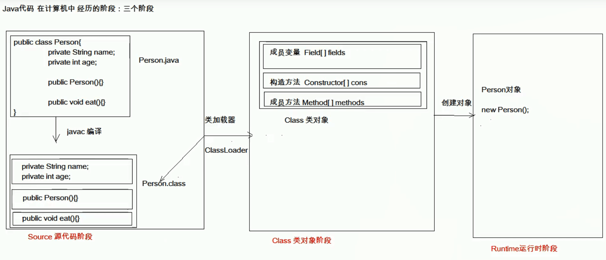

# 反射
反射是框架设计的灵魂。框架是半成品的软件，可以在框架的基础上进行软件开发，简化编码。

反射机制：是将类的各个组成部分封装为其他对象。在运行状态中，对于任意一个类，都能知道这个类的所有属性和方法；对于任意一个对象，都能调用它的任意方法和属性（包括私有的）；这种动态获取信息以及动态调用对象方法的功能就是java的反射机制。

例如：java代码在计算机中经历的三个阶段就有用到反射

在图中，Source源代码阶段，成员变量被封装成Field对象，构造方法被封装成Construction对象，成员方法被封装成Method对象

反射的好处：

1.可以在程序运行过程中，操作这些对象，比如创建一个字符串对象，可以在idea运行的过程中操作，得到它其中的一些方法

2.可以解耦（降低程序的一些耦合性，紧密的联系程度），提高程序的可扩展性

## 获取class类对象的方式
要了解反射，要先对反射的常用对象有基本了解。

Class：class类的实例表示正在运行的java应用程序中的类和接口

constructor：关于类的构造方法信息以及对它的访问权限

field：提供有关类或接口的属性信息，以及对它的动态访问权限

method：提供关于类或接口上单独某个方法的信息

1.class.forName("全类名"); 在java代码的第一个阶段，将字节码文件加载进内存，返回class对象。多用于配置文件，将类名定义在配置文件中。读取文件，加载类。
  
2.类名.class; 在java代码的第二个阶段，通过类名的属性Class获取。多用于参数的传递
  
3.对象. getClass(); 在java代码的第三个阶段，getClass()方法在Object类中定义着。多用于对象的获取字节码的方式
  
```
public static void main(String[] args) throws Exception {
        //1.class.forName("全类名");
        Class cls1 = Class.forName("cn.reflect.Person");
        System.out.println(cls1);
        //2.类名.class;
        Class<Person> cls2 = Person.class;
        System.out.println(cls2);
        //3.对象. getClass();
        Person p = new Person();
        Class cls3 = p.getClass();
        System.out.println(cls3);
        //结果为true
        System.out.println(cls1 == cls2 && cls1 == cls3);
    }
```
结论

同一个字节码文件(*.class)在一次程序运行过程中，只会被加载一次，不论通过哪一种方式获取的Class对象都是同一个

## 使用class对象
### class对象功能
1.获取功能

(1).获取成员变量们

Field[] getFields() 获取所有public修饰的成员变量</br>
Field getField(String name) 获取指定名称的public修饰的成员变量</br>
Field[] getDeclaredFields() 获取所有的成员变量，不考虑修饰符，私有属性也可以被访问，反射可以在类外调用私有属性</br>
直接使用这个方法获取会报错，可以通过一个方法忽略访问权限修饰符的安全检查：setAccessible(true)：暴力反射

Field getDeclaredField(String name) 

(2).获取构造方法们

Constructor<T> getConstructor(Class<?>... parameterTypes)</br>
Constructor<?>[] getConstructors() </br>
Constructor<T> getDeclaredConstructor(Class<?>... parameterTypes)</br>
Constructor<?>[] getDeclaredConstructors() 

(3).获取成员方法们
Method getMethod(String name, Class<?>... parameterTypes)</br>
Method[] getMethods()</br>
Method getDeclaredMethod(String name, Class<?>... parameterTypes)</br>
Method[] getDeclaredMethods()

(4).获取类名
 
 String getName()


### Field：成员变量
设置值： void set(Object obj,Object value)

获取值： get(Object obj)

忽略访问权限修饰符的安全检查： setAccessible(true) 暴力反射

如
```
//获取所有public修饰的成员变量
Field [] fields = personClass.getFields();
//获取指定名称的public的成员变量
Field a = personClass.getField("a");
Person p = new Person();
Object value = a.get(p);
System.out.println(value);
//获取私有属性
Field d = personClass.getField("d");
//需要忽略访问权限修饰符的安全检查
d.setAccesssible(true);
Object value1 = a.get(p);
System.out.println(value1);
```


### construction：构造方法
创建对象： TnewInstance(Object... initargs)；如果使用空参数构造方法创建对象，操作可以简化：class对象的newInstance方法

如
```
Constructor cons = personClass.getConstructor(String.class,int.class);
System.out.println(cons);
//创建对象
Object person = cons.newInstance("张三",23);
System.out.println(person);

//空参数构造方法
Object o = personClass.newInstance();
System.out.println(o);
```


### method：方法对象
执行方法：Object invoke (Object obj,Object... args)

如
```
//获取指定名称的方法
Method eat_method = personClass.getMethod("eat");
Person p = new Person();
//执行方法
eat_method.invoke(p);
```

获取方法名称：String getName：获取方法名


## 反射案例
需求：写一个“框架”，在不改变该类的任何代码的前提下，可以帮我们创建任意类的对象，并且执行其中的任意方法

实现

1.配置文件

2.反射

步骤

1.讲需要创建的对象的全类名和需要执行的方法定义在配置文件中

2.在程序中加载读取配置文件

3.使用反射技术来加载类文件进内存

4.创建对象

5.执行方法

代码
```
//配置文件，需要用到什么类，就修改配置文件
//类的名字要是全类名，从包开始
className=cn.reflect.Student
methodName=sleep

//具体的实现代码
public static void main(String[] args) throws Exception {
        //1.加载配置文件
        //1.1创建对象
        Properties pro = new Properties();
        //1.2加载配置文件，转换为一个map集合
        //1.2.1获取class目录下的配置文件
        ClassLoader classLoader =  ReflectTest.class.getClassLoader();
        InputStream is = classLoader.getResourceAsStream("pro.properties");
        pro.load(is);

        //2.获取配置文件中定义的数据
        String classname = pro.getProperty("className");
        String methodname = pro.getProperty("methodName");

        //3.加载该类进内存
        Class cls = Class.forName(classname);
        //4.创建对象
        Object obj = cls.newInstance();
        //5.获取方法对象
        Method method = cls.getMethod(methodname);
        //6.执行方法
        method.invoke(obj);
    }
```
