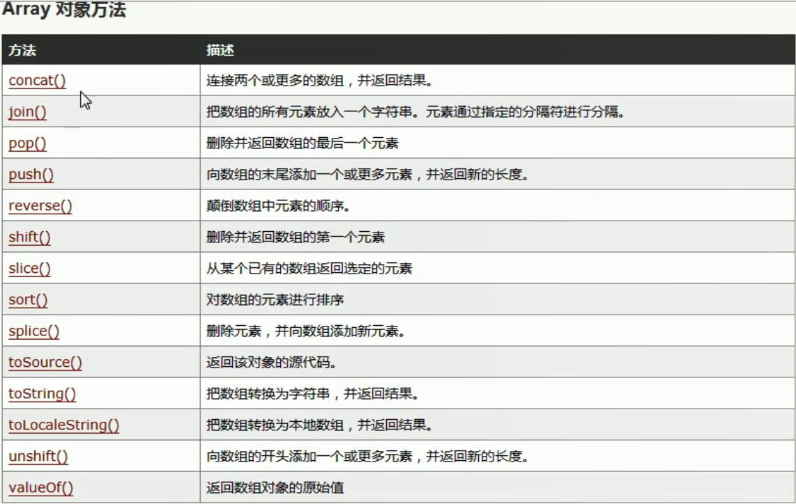

# JavaScript
概念：JavaScript是客户端脚本语言。运行在客户端浏览器中，每一个浏览器都有JavaScript的解析引擎。   
功能：可以增强用户和HTML页面的交互过程，可以来控制HTML元素，让页面有一些动态的效果，增强用户的体验  
JavaScript = ECMAScript + JavaScript自己特有的东西（BOM + DOM）  
ECMAScript：客户端脚本语言的标准  
1.基本语法
  * 与HTML的结合方式
    * 内部JS
      * 定义<script>标签，标签体内就是JS代码
    * 外部JS
      * 定义<script>标签，通过src属性引入外部写好的JS文件
    * 注意
      * <script>标签可以定义在HTML页面中的任何地方，但是定义的位置会影响执行顺序
      * <script>标签可以定义多个
  * 注释
    * 单行注释：//注释内容
    * 多行注释：/* 注释内容 */
  * 数据类型
    * 原始数据类型（基本数据类型）
      * number：数字，整数/小数/NaN(not a number 一个不是数字的数字类型)
      * string：字符串，单引号和双引号都可以
      * boolean：布尔类型，true/false
      * null：一个对象为空的占位符
      * undefined：未定义，如果一个变量没有给初始化值，则会被默认赋值为undefined
    * 引用数据类型：对象
  * 变量：
    * 变量：一小块存储数据的内存空间
    * java语言是强类型的语言，而JavaScript是弱类型的语言
      * 强类型：在开辟变量存储空间时定义了空间将来存储的数据的数据类型，只能用来存储固定类型的数据
      * 弱类型：在开辟变量存储空间时不定义空间将来存储的数据的数据类型，可以用来存储任意类型的数据
    * 语法
      * var 变量名 = 初始化值 ;
    * 用typeof运算符可以知道变量的数据类型，用法是typeof(变量名);
      * 其中typeof运算符对于null值会返回"Object"。这实际上是JavaScript最初实现中的一个错误，然后被ECMAScript沿用，现在null被认为是对象的占位符，从而解释了这一矛盾，但从技术上来说，它任然是原始值。
    ```ruby 
    //定义变量
    var a = 3;
    a = "abc";
    document.write(a + "</br>");
    //定义number类型
    var num1 = 5;
    var num2 = 5.3;
    var num3 = NaN;
    //输出到页面上
    document.write(num1 + "</br>");
    document.write(num2 + "</br>");
    document.write(num3 + "</br>");
    //定义string
    var str1 = "abc";
    var str2 = 'abc';
    document.write(str1 + "</br>");
    document.write(str2 + "</br>");
    //定义Boolean类型
    var flag = true;
    document.write(flag + "</br>");
    //定义null和undefined
    var obj1 = null;
    var obj2 = undefined;
    var obj3;
    document.write(obj1 + "</br>");
    document.write(obj2 + "</br>");
    document.write(obj3 + "</br>");
    ```
  * 运算符
    * 一元运算符：只有一个运算数的运算符
      * ++，--，+（正号），-（负号）
      * 注意：在JavaScript中，使用正负号进行运算时，如果运算数不是运算符所要求的类型（正负号只能是number类型），那么JavaScript引擎会自动的将运算数进行类型转换
      * 其他类型转number的规则
        * string转number：按照字面值转换，如果字面值不是数字，那么转为NaN（不是数字的数字）,NaN加别的数字也是NaN
        * boolean转number：true转为1，false转为0
      ```ruby 
      var a = +"123" //a=123
      var b = +"abc" //b=NaN
      var f1 = +true; //f1=1
      var f2 = +false; //f2=0
      ```
    * 算数运算符
      * +，-，*，/，%....
    * 赋值运算符
      * =，+=，-=.....
    * 比较运算符
      * <，>，>=，<=，==，===(全等)
      * 比较方式
        * 类型相同：直接比较
          * 字符串：按照字典顺序比较，按位逐一比较，知道得出大小为止
        * 类型不同：先进行类型转换，再进行比较
          * ===：全等于，在比较之前，先判断类型，如果类型不一样，则直接返回false
    * 逻辑运算符
      * &&，||，!
      * 其他类型转boolean：如果其他类型参与逻辑运算
        * number转boolean：0和NaN为假，非0为真
        * string转boolean：除了空字符串（""）为false，其余都是true
        * null和undefined转boolean：都是false
        * 对象转boolean：所有对象都是true
        ```
        //JavaScript中可以这样来定义，简化书写
        //用来判断是否为空字符串，防止空指针异常
        var obj = "";
        if(obj){ //防止空指针异常
          document.write("123");
        }
        //等于
        if(obj != null && obj.length > 0){
          document.write("123");
        }
        ```
    * 三元运算符
      * ? ：
        * 语法：表达式?值1:值2;
        * 判断表达式的值，如果是true则取值1，如果是false则取值2；
  * 流程控制语句
    * 1.if...else...
    * 2.switch
      * 在java中，switch语句中可以接收的数据类型：byte，int，short，char，枚举（1.5后），String（1.7后）
      * 在JavaScript中，switch语句可以接收任意的原始数据类型
    * 3.while
    * 4.do...while...
    * 5.for
  * JavaScript的特殊语法：都不建议使用
    * 1.语句以;号结尾，如果一行只有一条语句则;号可以省略
    * 2.变量的定义使用var关键字，也可以不使用
      * 用和不用的区别：变量的作用范围不一样
        * 用：定义的变量是局部变量
        * 不用：定义的变量是全局变量
```ruby
练习：打印9*9乘法表，在页面展示
<title>9*9乘法表</title>
    <style>
        td{
            border: 1px solid;
        }
    </style>
    
    <script>
        document.write("<table align='center'>");
        for(var i=1 ; i<=9 ; i++){
            document.write("<tr>");
            for (var j=1 ; j<=i ; j++){
                document.write("<td>");
                document.write(i + " * " + j + " = " + i*j);
                document.write("&nbsp;&nbsp;&nbsp;");
                document.write("</td>");
            }
            document.write("</tr>");
        }
        document.write("</table>");
    </script>
```
2.基本对象
  * Function对象：函数（方法）对象
    * 创建
      * 1.var fun = new Function(形式参数列表，方法体);不常用
      * 2.function 方法名称(形式参数列表){方法体} 常用
      * 3.var 方法名 = function(形式参数列表){方法体} 
    * 方法
    * 属性
      * length：代表形参的个数
    * 特点
      * 1.方法定义时，形参的类型不用写，都是var
      * 2.方法是一个对象，如果定义名称相同的方法，会覆盖
      * 3.在JavaScript中，方法的调用只与方法的名称有关，与参数列表无关
      * 4.在方法声明中有一个隐藏的内置对象（数组），arguments，封装所有的实际参数
    * 调用
      * 方法名称(实际参数列表);
```ruby
//创建方式1
var fun1 = new Function(a,"b","alert(a)");
fun(3,4);
//创建方式2
function fun2(a,b) {
  alert(a+b);
}
fun2(3,4);
//创建方式3
var fun3 = function (a,b) {
  alert(a-b);
}
fun3(5,3);

//方法调用,以下的都可以，没有就不接收，
fun2(1,2);
fun2(1);
fun2();
fun2(1,2，3);

//求任意个数的和
function add(){
  var sum =0;
  for(var i=0 ; i<arguments.length ; i++){
    sum = sum + arguments[i];
  }
  return sum;
}
var a = add(1,2,3,4,5,6,7,8,9,10);
document.write(a);
```
  * Array：数组对象
    * 创建：
      * 1.var arr = new Array(元素列表);
      * 2.var arr = new Array(默认长度); 如果只有一个数，则是默认的长度，而不是元素列表
      * 3.var arr = [元素列表];
    * 方法
      * 1.join()：将数组中的元素按照指定的分隔符拼接为字符串，如果没有参数则默认用,号拼接，有参数就用参数分隔拼接
      * 2.push()：向数组的末尾添加一个或更多元素，并返回新的长度

    * 属性
      * length：数组长度
    * 特点
      * 1.JavaScript中数组的元素类型是可变的
      * 2.在JavaScript数组的长度是可变的
      
  * Boolean
  * Date：日期对象
    * 创建
      * var date = new Date();
    * 方法
      * toLocalString()：返回当前date对象对应的时间本地字符串格式
      * getTime()：获取毫秒值，返回1970年1月1日到当前时间的毫秒值
  * Math：数学对象
    * 创建
      * 特点：Math对象不用创建，可以直接使用。Math.方法名 就可以用
    * 方法
      * random()：返回0-1之间的随机数，包含0，不包含1，即[0,1)
      * ceil(x)：对数进行上舍入，向上取整
      * floor(x)：对数进行下舍入，向下取整
      * round(x)：把数四舍五入为最接近的整数

    * 属性
      * PI：document.write(Math.PI);
  ```ruby
  //练习：取1-100之间的随机整数
  //分析：Math.random()得到[0,1)之间的小数，*100得到[0,99.999]，向下取整得到[0,99]，最后+1得到[1,100]
  var num = Math.floor((Math.random()*100))+1;
  document.write(num + "<br>");
  ```
  * Number
  * String
  * RegExp：正则表达式对象
      * 正则表达式：定义字符串的组成规则
        * 1.单个字符：[]，如：[a](单个字符a),[ab](a或b中一个),[a-zA-Z0-9](a-z或A-Z或0-9中的任意一个)
          * 特殊符号表示特殊含义的单个字符：
          * \d：表示单个数字字符 == [0-9]
          * \w：单个单词字符 == [a-zA-Z0-9]
        * 2.量词符号
          * ?：表示出现0次或1次
          * *：表示出现0次或多次
          * +：出现1次或多次，如：\w+（表示单个单词字符出现1次或多次）
          * {m,n}：表示 m <= 数量 <= n，在m和n之间，如：\w{6,12}（表示单个单词字符出现6到12次之间）
            * m如果缺省：{,n}：表示最多n次
            * n如果缺省：{m,}：表示最少m次
        * 3.开始结束符号
          * ^：表示开始
          * $：表示结束
      * 正则对象
        * 1.创建
          * var reg = new RegExp("正则表达式");
          * var reg = /正则表达式/;
        * 2.方法
          * test(参数)：验证指定的字符串是否符合正则定义的规范
      ```
      var reg1 = new RegExp("^\\w{6,12}$");
        var reg2 = /^\w{6,12}$/;
        // alert(reg1);
        // alert(reg2);
        var string = "TalentCan";
        document.write(reg2.test(string));
      ```
  * Global
    * 特点：是一个全局对象，Global中封装的方法不需要对象就可以直接调用，方法名();
    * 方法
      * encodeURI()：url编码
      * decodeURI()：url解码
      * encodeURIComponent()：url编码
      * decodeURIComponent()：url解码
    * url编码
      * UTF-8中一个汉字占3个字节
      * GDK中一个汉字占2个字节
      ```
      var str = "帅帅灿";
      var encode = encodeURI(str);
      document.write(encode + "</br>")
      ```


